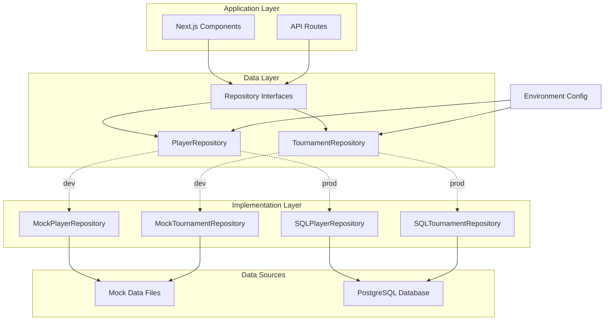

# Design Document: Environment-Based Data Layer

## Overview

This design implements a flexible data layer abstraction for the Riviera Open web application that seamlessly switches between mock data (development) and PostgreSQL database (production) based on environment configuration. The architecture follows the Repository Pattern to decouple data access logic from business logic, ensuring components remain unchanged regardless of the underlying data source.

The solution addresses the need to maintain rapid development iteration with mock data while supporting production deployment with a scalable SQL database. By using TypeScript interfaces and dependency injection, we achieve type safety and testability across both implementations.

**Key Design Principles:**

- Single Responsibility: Each repository handles one entity type
- Dependency Inversion: Components depend on abstractions, not concrete implementations
- Open/Closed: Easy to add new data sources without modifying existing code
- Type Safety: Consistent TypeScript types across all implementations

## Architecture

### High-Level Architecture



### Directory Structure

```
lib/
├── data/
│   ├── mock/                    # Mock data (existing files moved here)
│   │   ├── players.ts
│   │   ├── tournaments.ts
│   │   ├── gallery.ts
│   │   └── sponsors.ts
│   ├── repositories/            # Repository interfaces and factory
│   │   ├── interfaces.ts        # Repository interface definitions
│   │   ├── player-repository.ts
│   │   ├── tournament-repository.ts
│   │   └── repository-factory.ts
│   ├── implementations/
│   │   ├── mock/               # Mock implementations
│   │   │   ├── mock-player-repository.ts
│   │   │   └── mock-tournament-repository.ts
│   │   └── sql/                # SQL implementations
│   │       ├── db-client.ts    # PostgreSQL connection pool
│   │       ├── sql-player-repository.ts
│   │       └── sql-tournament-repository.ts
│   └── migrations/             # Database migrations
│       ├── 001_initial_schema.sql
│       └── 002_seed_data.ts
├── config/
│   └── environment.ts          # Environment configuration
└── types/                      # Existing type definitions
    ├── player.ts
    └── tournament.ts
```

## Components and Interfaces

### Environment Configuration

**Purpose:** Centralize environment variable management and data source selection.

**Interface:**

```typescript
// lib/config/environment.ts

export type Environment = "dev" | "prod";

export interface EnvironmentConfig {
  env: Environment;
  databaseUrl?: string;
}

export class ConfigurationError extends Error {
  constructor(message: string) {
    super(message);
    this.name = "ConfigurationError";
  }
}

export function getEnvironmentConfig(): EnvironmentConfig {
  const env = process.env.NEXT_PUBLIC_ENV as Environment;

  if (!env || !["dev", "prod"].includes(env)) {
    throw new ConfigurationError(
      'NEXT_PUBLIC_ENV must be set to "dev" or "prod"'
    );
  }

  if (env === "prod") {
    const databaseUrl = process.env.DATABASE_URL;
    if (!databaseUrl) {
      throw new ConfigurationError(
        'DATABASE_URL must be set when NEXT_PUBLIC_ENV is "prod"'
      );
    }
    return { env, databaseUrl };
  }

  return { env };
}
```

### Repository Interfaces

**Purpose:** Define contracts for data access operations that both mock and SQL implementations must fulfill.

**Interface:**

```typescript
// lib/data/repositories/interfaces.ts

import { Player, Tournament, Level, TournamentStatus } from "@/lib/types";

export interface IPlayerRepository {
  // Read operations
  getAll(): Promise<Player[]>;
  getById(id: string): Promise<Player | null>;
  getByLevel(level: Level): Promise<Player[]>;

  // Write operations
  create(player: Omit<Player, "id" | "rank">): Promise<Player>;
  update(id: string, player: Partial<Player>): Promise<Player>;
  updatePoints(id: string, points: number): Promise<Player>;

  // Ranking operations
  recalculateRankings(level: Level): Promise<void>;
}

export interface ITournamentRepository {
  // Read operations
  getAll(): Promise<Tournament[]>;
  getById(id: string): Promise<Tournament | null>;
  getByStatus(status: TournamentStatus): Promise<Tournament[]>;
  getByLevel(level: Level): Promise<Tournament[]>;

  // Write operations
  create(tournament: Omit<Tournament, "id">): Promise<Tournament>;
  update(id: string, tournament: Partial<Tournament>): Promise<Tournament>;
  updateResults(
    id: string,
    results: Tournament["results"]
  ): Promise<Tournament>;
}

export class NotFoundError extends Error {
  constructor(entityType: string, id: string) {
    super(`${entityType} with id ${id} not found`);
    this.name = "NotFoundError";
  }
}

export class ValidationError extends Error {
  constructor(message: string, public fields: Record<string, string>) {
    super(message);
    this.name = "ValidationError";
  }
}
```

### Repository Factory

**Purpose:** Create appropriate repository instances based on environment configuration.

**Implementation:**

```typescript
// lib/data/repositories/repository-factory.ts

import { getEnvironmentConfig } from "@/lib/config/environment";
import { IPlayerRepository, ITournamentRepository } from "./interfaces";
import { MockPlayerRepository } from "../implementations/mock/mock-player-repository";
import { MockTournamentRepository } from "../implementations/mock/mock-tournament-repository";
import { SQLPlayerRepository } from "../implementations/sql/sql-player-repository";
import { SQLTournamentRepository } from "../implementations/sql/sql-tournament-repository";
import { getDbClient } from "../implementations/sql/db-client";

class RepositoryFactory {
  private static playerRepository: IPlayerRepository | null = null;
  private static tournamentRepository: ITournamentRepository | null = null;

  static getPlayerRepository(): IPlayerRepository {
    if (!this.playerRepository) {
      const config = getEnvironmentConfig();

      if (config.env === "dev") {
        this.playerRepository = new MockPlayerRepository();
      } else {
        const dbClient = getDbClient();
        this.playerRepository = new SQLPlayerRepository(dbClient);
      }
    }

    return this.playerRepository;
  }

  static getTournamentRepository(): ITournamentRepository {
    if (!this.tournamentRepository) {
      const config = getEnvironmentConfig();

      if (config.env === "dev") {
        this.tournamentRepository = new MockTournamentRepository();
      } else {
        const dbClient = getDbClient();
        this.tournamentRepository = new SQLTournamentRepository(dbClient);
      }
    }

    return this.tournamentRepository;
  }

  // For testing: reset singleton instances
  static reset(): void {
    this.playerRepository = null;
    this.tournamentRepository = null;
  }
}

export default RepositoryFactory;
```

### Mock Repository Implementation

**Purpose:** Provide in-memory data access for development environment.

**Implementation Pattern:**

```typescript
// lib/data/implementations/mock/mock-player-repository.ts

import {
  IPlayerRepository,
  NotFoundError,
} from "../../repositories/interfaces";
import { Player, Level } from "@/lib/types";
import { players as mockPlayers } from "../../mock/players";

export class MockPlayerRepository implements IPlayerRepository {
  private players: Player[];

  constructor() {
    // Deep clone to avoid mutations affecting the original mock data
    this.players = JSON.parse(JSON.stringify(mockPlayers));
  }

  async getAll(): Promise<Player[]> {
    return [...this.players];
  }

  async getById(id: string): Promise<Player | null> {
    const player = this.players.find((p) => p.id === id);
    return player ? { ...player } : null;
  }

  async getByLevel(level: Level): Promise<Player[]> {
    return this.players.filter((p) => p.level === level).map((p) => ({ ...p }));
  }

  async create(playerData: Omit<Player, "id" | "rank">): Promise<Player> {
    const newPlayer: Player = {
      ...playerData,
      id: `mock-${Date.now()}`,
      rank: 0, // Will be set by recalculateRankings
    };

    this.players.push(newPlayer);
    await this.recalculateRankings(newPlayer.level);

    return { ...newPlayer };
  }

  async update(id: string, updates: Partial<Player>): Promise<Player> {
    const index = this.players.findIndex((p) => p.id === id);
    if (index === -1) {
      throw new NotFoundError("Player", id);
    }

    this.players[index] = { ...this.players[index], ...updates };

    // Recalculate rankings if points changed
    if (updates.points !== undefined) {
      await this.recalculateRankings(this.players[index].level);
    }

    return { ...this.players[index] };
  }

  async updatePoints(id: string, points: number): Promise<Player> {
    return this.update(id, { points });
  }

  async recalculateRankings(level: Level): Promise<void> {
    const levelPlayers = this.players.filter((p) => p.level === level);
    levelPlayers.sort((a, b) => b.points - a.points);

    levelPlayers.forEach((player, index) => {
      const playerIndex = this.players.findIndex((p) => p.id === player.id);
      this.players[playerIndex].rank = index + 1;
    });
  }
}
```

### SQL Database Client

**Purpose:** Manage PostgreSQL connection pool with singleton pattern for Next.js.

**Implementation:**

```typescript
// lib/data/implementations/sql/db-client.ts

import { Pool, PoolClient, PoolConfig } from "pg";
import { getEnvironmentConfig } from "@/lib/config/environment";

export class DatabaseConnectionError extends Error {
  constructor(message: string, public cause?: Error) {
    super(message);
    this.name = "DatabaseConnectionError";
  }
}

class DatabaseClient {
  private static instance: Pool | null = null;
  private static connectionAttempts = 0;
  private static readonly MAX_RETRIES = 3;
  private static readonly RETRY_DELAY_MS = 1000;

  static getPool(): Pool {
    if (!this.instance) {
      const config = getEnvironmentConfig();

      if (config.env !== "prod" || !config.databaseUrl) {
        throw new DatabaseConnectionError(
          "Database URL not configured for production environment"
        );
      }

      const poolConfig: PoolConfig = {
        connectionString: config.databaseUrl,
        max: 20, // Maximum pool size
        idleTimeoutMillis: 30000,
        connectionTimeoutMillis: 10000,
      };

      this.instance = new Pool(poolConfig);

      // Handle pool errors
      this.instance.on("error", (err) => {
        console.error("Unexpected database pool error:", err);
      });

      // Log successful connection
      this.instance.on("connect", () => {
        console.log("Database connection established");
        this.connectionAttempts = 0;
      });
    }

    return this.instance;
  }

  static async query<T = any>(text: string, params?: any[]): Promise<T[]> {
    const pool = this.getPool();

    try {
      const result = await pool.query(text, params);
      return result.rows;
    } catch (error) {
      if (this.connectionAttempts < this.MAX_RETRIES) {
        this.connectionAttempts++;
        console.warn(
          `Query failed, retrying (${this.connectionAttempts}/${this.MAX_RETRIES})...`
        );

        await new Promise((resolve) =>
          setTimeout(resolve, this.RETRY_DELAY_MS * this.connectionAttempts)
        );

        return this.query<T>(text, params);
      }

      throw new DatabaseConnectionError(
        "Database query failed after retries",
        error as Error
      );
    }
  }

  static async getClient(): Promise<PoolClient> {
    const pool = this.getPool();
    return pool.connect();
  }

  static async close(): Promise<void> {
    if (this.instance) {
      await this.instance.end();
      this.instance = null;
      console.log("Database connection pool closed");
    }
  }

  // For testing: reset singleton
  static reset(): void {
    this.instance = null;
    this.connectionAttempts = 0;
  }
}

export const getDbClient = () => DatabaseClient;
export default DatabaseClient;
```

### SQL Repository Implementation

**Purpose:** Provide PostgreSQL-backed data access for production environment.

**Implementation Pattern:**

```typescript
// lib/data/implementations/sql/sql-player-repository.ts

import {
  IPlayerRepository,
  NotFoundError,
} from "../../repositories/interfaces";
import { Player, Level, TournamentResult } from "@/lib/types";
import DatabaseClient from "./db-client";

interface PlayerRow {
  id: string;
  first_name: string;
  last_name: string;
  photo: string;
  level: Level;
  points: number;
  rank: number;
}

interface ContactRow {
  email: string;
  phone: string;
}

interface SocialRow {
  instagram?: string;
  facebook?: string;
  twitter?: string;
}

interface TournamentResultRow {
  tournament_id: string;
  placement: 1 | 2;
  date: string;
  club: string;
  photos: string[];
}

export class SQLPlayerRepository implements IPlayerRepository {
  constructor(private db: typeof DatabaseClient) {}

  async getAll(): Promise<Player[]> {
    const players = await this.db.query<PlayerRow>(
      "SELECT * FROM players ORDER BY level, rank"
    );

    return Promise.all(players.map((p) => this.hydratePlayer(p)));
  }

  async getById(id: string): Promise<Player | null> {
    const players = await this.db.query<PlayerRow>(
      "SELECT * FROM players WHERE id = $1",
      [id]
    );

    if (players.length === 0) {
      return null;
    }

    return this.hydratePlayer(players[0]);
  }

  async getByLevel(level: Level): Promise<Player[]> {
    const players = await this.db.query<PlayerRow>(
      "SELECT * FROM players WHERE level = $1 ORDER BY rank",
      [level]
    );

    return Promise.all(players.map((p) => this.hydratePlayer(p)));
  }

  async create(playerData: Omit<Player, "id" | "rank">): Promise<Player> {
    const client = await this.db.getClient();

    try {
      await client.query("BEGIN");

      // Insert player
      const playerResult = await client.query<PlayerRow>(
        `INSERT INTO players (first_name, last_name, photo, level, points, rank)
         VALUES ($1, $2, $3, $4, $5, 0)
         RETURNING *`,
        [
          playerData.firstName,
          playerData.lastName,
          playerData.photo,
          playerData.level,
          playerData.points,
        ]
      );

      const playerId = playerResult.rows[0].id;

      // Insert contact
      await client.query(
        `INSERT INTO player_contacts (player_id, email, phone)
         VALUES ($1, $2, $3)`,
        [playerId, playerData.contact.email, playerData.contact.phone]
      );

      // Insert socials
      await client.query(
        `INSERT INTO player_socials (player_id, instagram, facebook, twitter)
         VALUES ($1, $2, $3, $4)`,
        [
          playerId,
          playerData.socials.instagram,
          playerData.socials.facebook,
          playerData.socials.twitter,
        ]
      );

      await client.query("COMMIT");

      // Recalculate rankings
      await this.recalculateRankings(playerData.level);

      const player = await this.getById(playerId);
      return player!;
    } catch (error) {
      await client.query("ROLLBACK");
      throw error;
    } finally {
      client.release();
    }
  }

  async update(id: string, updates: Partial<Player>): Promise<Player> {
    const existing = await this.getById(id);
    if (!existing) {
      throw new NotFoundError("Player", id);
    }

    const client = await this.db.getClient();

    try {
      await client.query("BEGIN");

      // Build dynamic update query for player table
      const playerUpdates: string[] = [];
      const playerValues: any[] = [];
      let paramIndex = 1;

      if (updates.firstName !== undefined) {
        playerUpdates.push(`first_name = $${paramIndex++}`);
        playerValues.push(updates.firstName);
      }
      if (updates.lastName !== undefined) {
        playerUpdates.push(`last_name = $${paramIndex++}`);
        playerValues.push(updates.lastName);
      }
      if (updates.photo !== undefined) {
        playerUpdates.push(`photo = $${paramIndex++}`);
        playerValues.push(updates.photo);
      }
      if (updates.points !== undefined) {
        playerUpdates.push(`points = $${paramIndex++}`);
        playerValues.push(updates.points);
      }

      if (playerUpdates.length > 0) {
        playerValues.push(id);
        await client.query(
          `UPDATE players SET ${playerUpdates.join(
            ", "
          )} WHERE id = $${paramIndex}`,
          playerValues
        );
      }

      // Update contact if provided
      if (updates.contact) {
        await client.query(
          `UPDATE player_contacts 
           SET email = COALESCE($1, email), phone = COALESCE($2, phone)
           WHERE player_id = $3`,
          [updates.contact.email, updates.contact.phone, id]
        );
      }

      // Update socials if provided
      if (updates.socials) {
        await client.query(
          `UPDATE player_socials 
           SET instagram = COALESCE($1, instagram),
               facebook = COALESCE($2, facebook),
               twitter = COALESCE($3, twitter)
           WHERE player_id = $4`,
          [
            updates.socials.instagram,
            updates.socials.facebook,
            updates.socials.twitter,
            id,
          ]
        );
      }

      await client.query("COMMIT");

      // Recalculate rankings if points changed
      if (updates.points !== undefined) {
        await this.recalculateRankings(existing.level);
      }

      const player = await this.getById(id);
      return player!;
    } catch (error) {
      await client.query("ROLLBACK");
      throw error;
    } finally {
      client.release();
    }
  }

  async updatePoints(id: string, points: number): Promise<Player> {
    return this.update(id, { points });
  }

  async recalculateRankings(level: Level): Promise<void> {
    await this.db.query(
      `WITH ranked_players AS (
        SELECT id, ROW_NUMBER() OVER (ORDER BY points DESC) as new_rank
        FROM players
        WHERE level = $1
      )
      UPDATE players
      SET rank = ranked_players.new_rank
      FROM ranked_players
      WHERE players.id = ranked_players.id`,
      [level]
    );
  }

  private async hydratePlayer(row: PlayerRow): Promise<Player> {
    // Fetch contact
    const contacts = await this.db.query<ContactRow>(
      "SELECT email, phone FROM player_contacts WHERE player_id = $1",
      [row.id]
    );

    // Fetch socials
    const socials = await this.db.query<SocialRow>(
      "SELECT instagram, facebook, twitter FROM player_socials WHERE player_id = $1",
      [row.id]
    );

    // Fetch tournament results
    const results = await this.db.query<TournamentResultRow>(
      `SELECT tournament_id, placement, date, club, photos
       FROM tournament_results
       WHERE player_id = $1
       ORDER BY date DESC`,
      [row.id]
    );

    return {
      id: row.id,
      firstName: row.first_name,
      lastName: row.last_name,
      photo: row.photo,
      level: row.level,
      points: row.points,
      rank: row.rank,
      contact: contacts[0] || { email: "", phone: "" },
      socials: socials[0] || {},
      tournamentResults: results.map((r) => ({
        tournamentId: r.tournament_id,
        placement: r.placement,
        date: r.date,
        club: r.club,
        photos: r.photos,
      })),
    };
  }
}
```

## Data Models

### Database Schema

The PostgreSQL schema normalizes the data structure while maintaining compatibility with the existing TypeScript types.

```sql
-- lib/data/migrations/001_initial_schema.sql

-- Players table
CREATE TABLE players (
  id UUID PRIMARY KEY DEFAULT gen_random_uuid(),
  first_name VARCHAR(100) NOT NULL,
  last_name VARCHAR(100) NOT NULL,
  photo VARCHAR(500) NOT NULL,
  level VARCHAR(10) NOT NULL CHECK (level IN ('Open', '1', '2', '3', '4', '5', '6')),
  points INTEGER NOT NULL DEFAULT 0,
  rank INTEGER NOT NULL DEFAULT 0,
  created_at TIMESTAMP WITH TIME ZONE DEFAULT CURRENT_TIMESTAMP,
  updated_at TIMESTAMP WITH TIME ZONE DEFAULT CURRENT_TIMESTAMP
);

-- Player contacts (1:1 relationship)
CREATE TABLE player_contacts (
  player_id UUID PRIMARY KEY REFERENCES players(id) ON DELETE CASCADE,
  email VARCHAR(255) NOT NULL,
  phone VARCHAR(50) NOT NULL
);

-- Player socials (1:1 relationship)
CREATE TABLE player_socials (
  player_id UUID PRIMARY KEY REFERENCES players(id) ON DELETE CASCADE,
  instagram VARCHAR(255),
  facebook VARCHAR(255),
  twitter VARCHAR(255)
);

-- Tournaments table
CREATE TABLE tournaments (
  id UUID PRIMARY KEY DEFAULT gen_random_uuid(),
  name VARCHAR(200) NOT NULL,
  date DATE NOT NULL,
  club VARCHAR(200) NOT NULL,
  location VARCHAR(200) NOT NULL,
  level VARCHAR(10) NOT NULL CHECK (level IN ('Open', '1', '2', '3', '4', '5', '6')),
  status VARCHAR(20) NOT NULL CHECK (status IN ('upcoming', 'in-progress', 'completed')),
  registration_open BOOLEAN NOT NULL DEFAULT false,
  description TEXT,
  created_at TIMESTAMP WITH TIME ZONE DEFAULT CURRENT_TIMESTAMP,
  updated_at TIMESTAMP WITH TIME ZONE DEFAULT CURRENT_TIMESTAMP
);

-- Tournament results (stores winners)
CREATE TABLE tournament_winners (
  tournament_id UUID REFERENCES tournaments(id) ON DELETE CASCADE,
  placement INTEGER NOT NULL CHECK (placement IN (1, 2)),
  player_id UUID REFERENCES players(id) ON DELETE CASCADE,
  PRIMARY KEY (tournament_id, placement)
);

-- Tournament photos (1:many relationship)
CREATE TABLE tournament_photos (
  id UUID PRIMARY KEY DEFAULT gen_random_uuid(),
  tournament_id UUID REFERENCES tournaments(id) ON DELETE CASCADE,
  photo_url VARCHAR(500) NOT NULL,
  display_order INTEGER NOT NULL DEFAULT 0
);

-- Tournament results for players (many:many relationship)
CREATE TABLE tournament_results (
  id UUID PRIMARY KEY DEFAULT gen_random_uuid(),
  player_id UUID REFERENCES players(id) ON DELETE CASCADE,
  tournament_id UUID REFERENCES tournaments(id) ON DELETE CASCADE,
  placement INTEGER NOT NULL CHECK (placement IN (1, 2)),
  date DATE NOT NULL,
  club VARCHAR(200) NOT NULL,
  photos TEXT[] NOT NULL DEFAULT '{}',
  UNIQUE (player_id, tournament_id)
);

-- Indexes for performance
CREATE INDEX idx_players_level ON players(level);
CREATE INDEX idx_players_level_rank ON players(level, rank);
CREATE INDEX idx_tournaments_status ON tournaments(status);
CREATE INDEX idx_tournaments_level ON tournaments(level);
CREATE INDEX idx_tournaments_date ON tournaments(date DESC);
CREATE INDEX idx_tournament_results_player ON tournament_results(player_id);
CREATE INDEX idx_tournament_results_tournament ON tournament_results(tournament_id);

-- Updated_at trigger function
CREATE OR REPLACE FUNCTION update_updated_at_column()
RETURNS TRIGGER AS $$
BEGIN
  NEW.updated_at = CURRENT_TIMESTAMP;
  RETURN NEW;
END;
$$ language 'plpgsql';

-- Apply updated_at trigger to tables
CREATE TRIGGER update_players_updated_at BEFORE UPDATE ON players
  FOR EACH ROW EXECUTE FUNCTION update_updated_at_column();

CREATE TRIGGER update_tournaments_updated_at BEFORE UPDATE ON tournaments
  FOR EACH ROW EXECUTE FUNCTION update_updated_at_column();
```

### Type Mappings

**Database to TypeScript:**

- `UUID` → `string`
- `VARCHAR` → `string`
- `INTEGER` → `number`
- `BOOLEAN` → `boolean`
- `DATE` → `string` (ISO 8601 format)
- `TEXT[]` → `string[]`
- `TIMESTAMP WITH TIME ZONE` → `string` (ISO 8601 format)

**Enum Mappings:**

- Database `CHECK` constraints enforce the same values as TypeScript union types
- Level: `'Open' | '1' | '2' | '3' | '4' | '5' | '6'`
- TournamentStatus: `'upcoming' | 'in-progress' | 'completed'`

## Correctness Properties

_A property is a characteristic or behavior that should hold true across all valid executions of a system—essentially, a formal statement about what the system should do. Properties serve as the bridge between human-readable specifications and machine-verifiable correctness guarantees._

### Property 1: Implementation Equivalence

_For any_ data retrieval operation (getAll, getById, getByLevel, getByStatus), when executed on both MockRepository and SQLRepository with equivalent data, both implementations should return structurally equivalent results.

**Validates: Requirements 2.3**

### Property 2: Repository Filtering Correctness

_For any_ repository filter operation (getByLevel for players, getByStatus or getByLevel for tournaments) and any filter value, all returned entities should match the filter criteria.

**Validates: Requirements 3.3, 4.3, 4.4**

### Property 3: Create-Retrieve Round Trip

_For any_ valid entity data (player or tournament), creating the entity and then retrieving it by ID should return an equivalent entity with all fields preserved.

**Validates: Requirements 3.4, 4.5**

### Property 4: Update Idempotence

_For any_ existing entity and any valid update data, applying the same update twice should produce the same result as applying it once.

**Validates: Requirements 3.5, 4.6**

### Property 5: Points Update Triggers Ranking Recalculation

_For any_ player within a level, when their points are updated, the ranking order for all players in that level should reflect the new points values (highest points = rank 1).

**Validates: Requirements 3.6**

### Property 6: Data Completeness

_For any_ entity retrieved from a repository (player or tournament), all nested/related data fields (contact, socials, tournament results, photos) should be present and non-null where required by the type definition.

**Validates: Requirements 3.7, 4.8**

### Property 7: Not-Found Error Specificity

_For any_ non-existent entity ID, attempting to retrieve or update that entity should throw a NotFoundError containing both the entity type and the requested ID.

**Validates: Requirements 3.8, 9.2**

### Property 8: Migration Idempotence

_For any_ database state, running the migration scripts multiple times should produce the same final database schema and data as running them once.

**Validates: Requirements 7.5**

### Property 9: Data Transformation Consistency

_For any_ database row retrieved from SQL, the transformation to TypeScript types should produce a value that satisfies the TypeScript interface and can be serialized/deserialized without loss of information.

**Validates: Requirements 8.2, 8.3**

### Property 10: Validation Error Descriptiveness

_For any_ validation failure (invalid data, missing required fields), the thrown ValidationError should include a fields map that specifies which fields failed validation and why.

**Validates: Requirements 8.5, 9.3**

### Property 11: Error Context Completeness

_For any_ error thrown by the data layer (connection, query, not-found), the error message should include sufficient context to identify the operation type, entity involved, and failure reason.

**Validates: Requirements 9.1, 9.4**

### Property 12: Invalid Configuration Rejection

_For any_ invalid environment configuration (missing required variables, invalid values), the configuration validation should throw a ConfigurationError with a descriptive message before any data operations are attempted.

**Validates: Requirements 1.5**

## Error Handling

### Error Hierarchy

The data layer defines a clear error hierarchy for different failure scenarios:

```typescript
// Base error class
export class DataLayerError extends Error {
  constructor(message: string, public context?: Record<string, any>) {
    super(message);
    this.name = "DataLayerError";
  }
}

// Configuration errors
export class ConfigurationError extends DataLayerError {
  constructor(message: string) {
    super(message);
    this.name = "ConfigurationError";
  }
}

// Database connection errors
export class DatabaseConnectionError extends DataLayerError {
  constructor(message: string, public cause?: Error) {
    super(message, { cause });
    this.name = "DatabaseConnectionError";
  }
}

// Entity not found errors
export class NotFoundError extends DataLayerError {
  constructor(entityType: string, id: string) {
    super(`${entityType} with id ${id} not found`, { entityType, id });
    this.name = "NotFoundError";
  }
}

// Validation errors
export class ValidationError extends DataLayerError {
  constructor(message: string, public fields: Record<string, string>) {
    super(message, { fields });
    this.name = "ValidationError";
  }
}

// Query execution errors
export class QueryError extends DataLayerError {
  constructor(operation: string, entityType: string, cause?: Error) {
    super(`Failed to ${operation} ${entityType}`, {
      operation,
      entityType,
      cause,
    });
    this.name = "QueryError";
  }
}
```

### Error Handling Strategies

**Configuration Errors:**

- Thrown at application startup during environment validation
- Should prevent application from starting
- Logged with clear instructions for fixing configuration

**Connection Errors:**

- Retry with exponential backoff (3 attempts)
- Delays: 1s, 2s, 4s
- After exhausting retries, throw DatabaseConnectionError
- Include retry count and last error in context

**Query Errors:**

- Wrap database-specific errors in QueryError
- Include operation type (create, update, delete, query)
- Include entity type being operated on
- Preserve original error as cause for debugging

**Not Found Errors:**

- Thrown when entity ID doesn't exist
- Include entity type and requested ID
- Used for both read and update operations

**Validation Errors:**

- Thrown before database operations
- Include map of field names to error messages
- Prevent invalid data from reaching database

### Transaction Management

**SQL Implementation:**

- Use database transactions for multi-step operations (create with nested data, updates)
- Rollback on any error during transaction
- Release client connection in finally block
- Log transaction failures with full context

**Mock Implementation:**

- Use in-memory state snapshots for rollback simulation
- Maintain consistency across related data structures
- No actual transaction support needed (single-threaded)

## Testing Strategy

### Dual Testing Approach

The data layer requires both unit tests and property-based tests to ensure correctness:

**Unit Tests:**

- Specific examples of CRUD operations
- Edge cases (empty results, boundary values)
- Error conditions (invalid IDs, missing data)
- Configuration scenarios (dev vs prod)
- Connection pool behavior
- Migration script execution

**Property-Based Tests:**

- Universal properties across all inputs
- Implementation equivalence between mock and SQL
- Data integrity after operations
- Error handling consistency
- Idempotence properties

### Property-Based Testing Configuration

**Framework:** fast-check (already in dependencies)

**Configuration:**

- Minimum 100 iterations per property test
- Each test tagged with feature name and property number
- Tag format: `Feature: environment-data-layer, Property N: [property description]`

**Test Organization:**

```
lib/data/__tests__/
├── unit/
│   ├── mock-player-repository.test.ts
│   ├── mock-tournament-repository.test.ts
│   ├── sql-player-repository.test.ts
│   ├── sql-tournament-repository.test.ts
│   ├── repository-factory.test.ts
│   ├── environment-config.test.ts
│   └── db-client.test.ts
├── property/
│   ├── implementation-equivalence.test.ts
│   ├── repository-operations.test.ts
│   ├── data-integrity.test.ts
│   └── error-handling.test.ts
└── integration/
    ├── end-to-end-player-flow.test.ts
    └── end-to-end-tournament-flow.test.ts
```

### Test Data Generation

**For Property-Based Tests:**

```typescript
// Generators for property-based testing
import * as fc from "fast-check";
import { Level, TournamentStatus } from "@/lib/types";

export const levelArbitrary = fc.constantFrom(
  "Open",
  "1",
  "2",
  "3",
  "4",
  "5",
  "6"
) as fc.Arbitrary<Level>;

export const tournamentStatusArbitrary = fc.constantFrom(
  "upcoming",
  "in-progress",
  "completed"
) as fc.Arbitrary<TournamentStatus>;

export const playerArbitrary = fc.record({
  firstName: fc.string({ minLength: 1, maxLength: 50 }),
  lastName: fc.string({ minLength: 1, maxLength: 50 }),
  photo: fc.webUrl(),
  level: levelArbitrary,
  points: fc.integer({ min: 0, max: 5000 }),
  contact: fc.record({
    email: fc.emailAddress(),
    phone: fc.string({ minLength: 10, maxLength: 20 }),
  }),
  socials: fc.record({
    instagram: fc.option(fc.webUrl(), { nil: undefined }),
    facebook: fc.option(fc.webUrl(), { nil: undefined }),
    twitter: fc.option(fc.webUrl(), { nil: undefined }),
  }),
  tournamentResults: fc.array(
    fc.record({
      tournamentId: fc.uuid(),
      placement: fc.constantFrom(1, 2) as fc.Arbitrary<1 | 2>,
      date: fc.date().map((d) => d.toISOString().split("T")[0]),
      club: fc.string({ minLength: 1, maxLength: 100 }),
      photos: fc.array(fc.webUrl(), { maxLength: 5 }),
    }),
    { maxLength: 10 }
  ),
});

export const tournamentArbitrary = fc.record({
  name: fc.string({ minLength: 1, maxLength: 200 }),
  date: fc.date().map((d) => d.toISOString().split("T")[0]),
  club: fc.string({ minLength: 1, maxLength: 200 }),
  location: fc.string({ minLength: 1, maxLength: 200 }),
  level: levelArbitrary,
  status: tournamentStatusArbitrary,
  registrationOpen: fc.boolean(),
  description: fc.option(fc.string({ maxLength: 500 }), { nil: undefined }),
  photos: fc.array(fc.webUrl(), { minLength: 1, maxLength: 10 }),
});
```

### Test Database Setup

**For SQL Integration Tests:**

- Use a separate test database (configured via `TEST_DATABASE_URL`)
- Reset database state before each test
- Use transactions that rollback after tests
- Seed with minimal test data

**Docker Compose for Test Database:**

```yaml
# docker-compose.test.yml
version: "3.8"
services:
  test-db:
    image: postgres:16
    environment:
      POSTGRES_DB: riviera_test
      POSTGRES_USER: test_user
      POSTGRES_PASSWORD: test_password
    ports:
      - "5433:5432"
    tmpfs:
      - /var/lib/postgresql/data
```

### CI/CD Integration

**Test Execution Order:**

1. Unit tests (fast, no external dependencies)
2. Property-based tests (medium speed, mock data)
3. Integration tests (slower, requires test database)

**Coverage Requirements:**

- Minimum 80% code coverage for repository implementations
- 100% coverage for error handling paths
- All correctness properties must have corresponding tests

### Manual Testing Checklist

**Environment Switching:**

- [ ] Verify dev environment uses mock data
- [ ] Verify prod environment connects to database
- [ ] Verify configuration errors prevent startup
- [ ] Test switching between environments without code changes

**Data Operations:**

- [ ] Create, read, update operations work in both environments
- [ ] Rankings recalculate correctly after point updates
- [ ] Tournament results update correctly
- [ ] Nested data (contacts, socials, photos) persists correctly

**Error Scenarios:**

- [ ] Invalid IDs return appropriate errors
- [ ] Database connection failures trigger retries
- [ ] Validation errors include field details
- [ ] Transaction rollbacks work correctly

## Implementation Notes

### Migration from Current Structure

**Phase 1: Create New Structure (No Breaking Changes)**

1. Create new directory structure under `lib/data/`
2. Move existing mock data files to `lib/data/mock/`
3. Implement repository interfaces and mock implementations
4. Implement repository factory with environment detection

**Phase 2: Update Components (Gradual Migration)**

1. Update one component at a time to use repositories
2. Test each component thoroughly before moving to next
3. Keep old imports working during transition
4. Example migration:

```typescript
// Before
import { players } from "@/lib/data/players";

// After
import RepositoryFactory from "@/lib/data/repositories/repository-factory";
const playerRepo = RepositoryFactory.getPlayerRepository();
const players = await playerRepo.getAll();
```

**Phase 3: Add SQL Implementation**

1. Set up PostgreSQL database
2. Run migration scripts
3. Implement SQL repositories
4. Test SQL implementations thoroughly
5. Deploy to production with prod environment variables

**Phase 4: Cleanup**

1. Remove old direct imports once all components migrated
2. Remove old data files from original locations
3. Update documentation

### Performance Considerations

**Connection Pooling:**

- Pool size: 20 connections (configurable)
- Idle timeout: 30 seconds
- Connection timeout: 10 seconds
- Adjust based on production load

**Query Optimization:**

- Use indexes on frequently queried columns
- Batch operations where possible
- Consider caching for read-heavy operations
- Monitor slow queries and optimize

**Mock Data Performance:**

- Deep clone data to prevent mutations
- Consider using immutable data structures for large datasets
- Profile memory usage if mock data grows large

### Security Considerations

**Database Credentials:**

- Never commit DATABASE_URL to version control
- Use environment variables or secrets management
- Rotate credentials regularly
- Use least-privilege database users

**SQL Injection Prevention:**

- Always use parameterized queries
- Never concatenate user input into SQL strings
- Validate and sanitize all inputs
- Use TypeScript types to enforce valid values

**Connection Security:**

- Use SSL/TLS for database connections in production
- Configure connection string with `sslmode=require`
- Validate SSL certificates

### Monitoring and Observability

**Logging:**

- Log all database operations with timing
- Log configuration at startup
- Log errors with full context
- Use structured logging (JSON format)

**Metrics to Track:**

- Query execution time (p50, p95, p99)
- Connection pool utilization
- Error rates by type
- Repository operation counts

**Alerts:**

- Database connection failures
- Query timeouts
- High error rates
- Connection pool exhaustion
